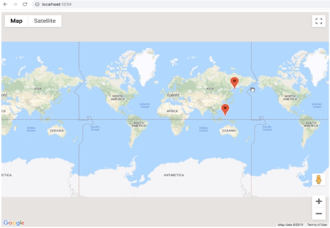

# TypeScript Google Maps Project

This project was developed to practice Google Maps Api Integration and TypeScript concepts such as creating classes and using interfaces as gatekeepers for class methods.

## Getting Started

1. Clone the repository: `git clone <repository_url>`
2. Create a Google Developer account with billing enabled. This requires a credit card tied to your Google account.
3. Generate an API key on the Google Developer's Console for Google Maps.
4. Open the index.html file located in the project's root directory.
5. Locate the following line in the index.html file: ``
6. Replace the API_KEY placeholder with your generated API key.
7. Save the index.html file.

## Running the Project

1. Open the project directory in your preferred code editor.
2. Install the necessary dependencies: `npm install`
3. This project uses parcel-bundler tool to help running TypeScript in the browser. `npx parcel index.html` .You can install parcel package if you haven't installed yet.
